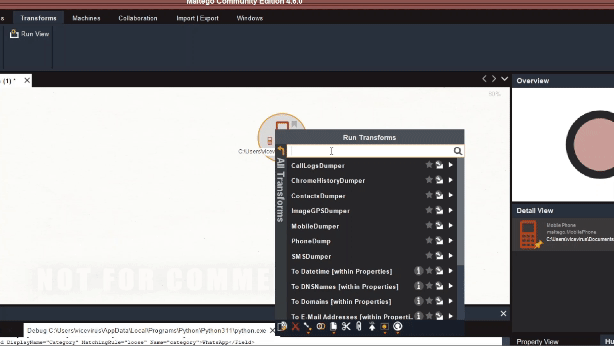

# Maltego Auto Mobile Dump

Maltego Auto Mobile Dump is a  Maltego transform for visualizing data extracted from mobile devices. This tool processes contacts, SMS messages, call logs, WhatsApp messages, Chrome browsing history, GPS data from images, and checks URLs against VirusTotal, providing a comprehensive overview of the data stored on a device.

Note: This project is part of GCC 2024 groupwork.

## Features

### Contacts Extraction

- **Location:** `/data/data/com.android.providers.contacts/databases/contacts2.db`
- 

### SMS Messages

- **Location:** `/data/data/com.android.providers.telephony/databases/mmssms.db`
- 

### Call Logs

- **Location:** `/data/data/com.android.providers.contacts/databases/calllog.db`
- 

### WhatsApp Messages

- **Location:** `/data/data/com.whatsapp/databases/msgstore.db`
- 

### Chrome Browsing History

- **Location:** `/data/data/com.android.chrome/app_chrome/Default/History`
- 

### GPS Data from Images

- **Location:** `/data/media/0/DCIM`
- 

### VirusTotal URL Analysis

- **API:** Utilizes the VirusTotal API.
- **Output:** Enriched Maltego entities with VirusTotal analysis results.
- 

### Find SMS For Contacts
- 

### Find Call Logs For Contacts
- 

## Note on Access Requirements

Accessing the `/data` partition on a mobile device typically requires **root access** or methods like **fastboot/JTAG**, depending on the device. These methods can bypass standard security mechanisms to retrieve data directly from the device's storage, which is essential for a comprehensive analysis. Please be aware that using these methods may void the warranty of the device and should be performed with caution.

## Usage

Use local transform. Example is available here [Maltego Local Transform Example](https://docs.maltego.com/support/solutions/articles/15000017605-local-transforms-example)

## Contributing

We welcome contributions from the community! Please read our contributing guidelines for more information on how to report issues, submit pull requests, and more.

